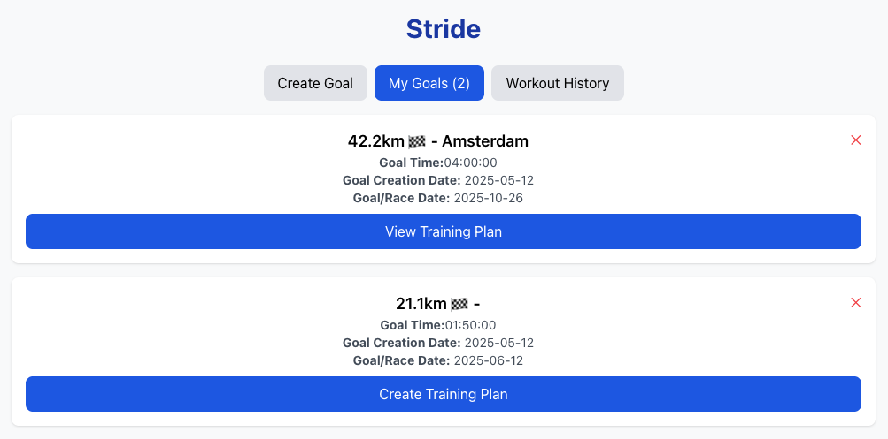

# Stride - Your Personal Running Coach

Stride helps runners prepare for races with AI-powered training plans. These plans take into account your goals, training preferences and fitness levels based on your Strava workouts.

## Technologies Used

- Backend: FastAPI, LangChain, Anthropic API

- Frontend: Vite, React, Tailwind CSS

- Data Storage: SQLite

- API Integration: Strava API

## Features

### Goal Management

- Set specific race goals with target times and dates




### Training Preferences

- Select your training preferences


### Customized Training Plans

- OAuth integration with Strava for secure access to user data
- AI-generated plans based on your preferences and fitness levels based on your Strava data


## Set Up

### Backend Setup

```
cd backend
python -m venv venv
source venv/bin/activate  # On Windows: venv\Scripts\activate
pip install -r requirements.txt
```

Create a .env file in the backend directory:

```
# The default is an Anthropic model. You would need credits from Anthropic https://console.anthropic.com/settings/billing
ANTHROPIC_KEY=your_anthropic_api_key
# Set up a developer account in Strava https://www.strava.com/settings/api
STRAVA_CLIENT_ID=your_client_id # Don't include " "
STRAVA_CLIENT_SECRET="your_client_secret"
STRAVA_REDIRECT_URI = "http://localhost:8080/callback"
FRONTEND_URL = "http://localhost:5173"

```

### Frontend Setup

```
cd frontend
npm install
npm run dev
```

## Running the Model

To start the development server, navigate to the project's root directory and run:

```
bash
npm run dev
```
